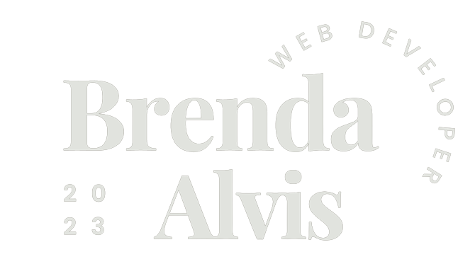

# 

    

  <a href="#About">About</a> •
  <a href="#how-to-use">How To Use</a> •
  <a href="#credits">Credits</a> •
  <a href="#license">License</a>

    

## About

Welcome to my work portfolio! Here, I aim to showcase my expertise in web development, combining both design and technical skills to create engaging and functional websites. With a passion for crafting visually appealing and user-friendly interfaces, I bring a unique blend of creativity and technical proficiency to my work.

In addition to my design prowess, I possess a strong foundation in various web development technologies and programming languages. I am proficient in HTML, CSS, and JavaScript, enabling me to build responsive and interactive web pages. I also have experience with front-end frameworks like Bootstrap and libraries like jQuery, and React.js empowering me to streamline development processes and enhance user experiences.

If you are interested in collaborating on a web development project or have any inquiries, please feel free to reach out. I have provided my contact information, including email and social media profiles, to make it easy to get in touch. I am excited to discuss how I can contribute to your web development needs and bring your ideas to life.

## How To Use
- [Deployed Website](https://bralvis2.github.io/portfolio/)
 
To access this website, you can click on the link above and naviate the site using the navigation bar. 

## Credits

This website uses the following open source packages:

- [React](https://reactjs.org/)
- [Font Awesome CDN](https://cdn.fontawesome.com/): Icon accessibility and faster loading.
- [Google Fonts](https://fonts.google.com/): Fonts

## License

MIT

---

> GitHub [@bralvis2](https://github.com/bralvis2) &nbsp;&middot;&nbsp;